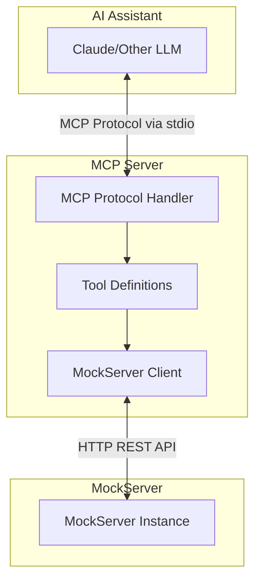

# Design Document

## Overview

This document describes the technical design for an MCP (Model Context Protocol) server that provides tools for interacting with James Bloom's MockServer. The server will be implemented in TypeScript using the official MCP SDK and will communicate with MockServer via its REST API.

## Architecture



The architecture follows a layered approach:
1. **MCP Protocol Layer** - Handles MCP communication using stdio transport
2. **Tool Layer** - Defines and implements MCP tools
3. **Client Layer** - Encapsulates MockServer REST API interactions

## Components and Interfaces

### 1. Entry Point (`src/index.ts`)

The main entry point that initializes the MCP server and registers tools.

```typescript
interface ServerConfig {
  mockServerHost: string;
  mockServerPort: number;
}
```

### 2. MockServer Client (`src/mockserver-client.ts`)

Encapsulates all HTTP communication with MockServer.

```typescript
interface MockServerClient {
  createExpectation(expectation: Expectation): Promise<void>;
  verify(request: RequestMatcher, times?: Times): Promise<VerificationResult>;
  clear(request?: RequestMatcher): Promise<void>;
  reset(): Promise<void>;
  retrieveRecordedRequests(request?: RequestMatcher): Promise<RecordedRequest[]>;
  getStatus(): Promise<ServerStatus>;
}
```

### 3. Tool Definitions (`src/tools/`)

Each MockServer operation is exposed as an MCP tool:

| Tool Name | Description | Parameters |
|-----------|-------------|------------|
| `mockserver_create_expectation` | Create a mock expectation | request matcher, response config |
| `mockserver_verify` | Verify requests were received | request matcher, times |
| `mockserver_clear` | Clear expectations/requests | request matcher (optional) |
| `mockserver_reset` | Full reset of MockServer | none |
| `mockserver_retrieve_requests` | Get recorded requests | request matcher (optional) |
| `mockserver_status` | Get server status | none |

## Data Models

### Request Matcher

```typescript
interface RequestMatcher {
  method?: string;
  path?: string;
  pathParameters?: Record<string, string[]>;
  queryStringParameters?: Record<string, string[]>;
  headers?: Record<string, string[]>;
  body?: BodyMatcher;
}

interface BodyMatcher {
  type: 'STRING' | 'JSON' | 'REGEX' | 'XPATH' | 'JSON_PATH';
  value: string;
  matchType?: 'STRICT' | 'ONLY_MATCHING_FIELDS';
}
```

### Response Configuration

```typescript
interface HttpResponse {
  statusCode?: number;
  headers?: Record<string, string[]>;
  body?: string | object;
  delay?: {
    timeUnit: 'MILLISECONDS' | 'SECONDS';
    value: number;
  };
}
```

### Expectation

```typescript
interface Expectation {
  id?: string;
  httpRequest: RequestMatcher;
  httpResponse?: HttpResponse;
  times?: {
    remainingTimes: number;
    unlimited: boolean;
  };
  timeToLive?: {
    timeUnit: 'MILLISECONDS' | 'SECONDS' | 'MINUTES';
    timeToLive: number;
  };
}
```

### Verification Types

```typescript
interface Times {
  atLeast?: number;
  atMost?: number;
  exactly?: number;
}

interface VerificationResult {
  success: boolean;
  matchedCount: number;
  message?: string;
}
```

### Server Status

```typescript
interface ServerStatus {
  host: string;
  port: number;
  reachable: boolean;
  version?: string;
}
```

## Error Handling

### Error Categories

1. **Connection Errors** - MockServer unreachable
2. **Validation Errors** - Invalid tool parameters
3. **MockServer Errors** - Errors returned by MockServer API

### Error Response Format

```typescript
interface ToolError {
  code: string;
  message: string;
  details?: Record<string, unknown>;
}
```

### Error Handling Strategy

- All MockServer client methods wrap HTTP calls in try-catch blocks
- Connection timeouts set to 5 seconds
- Errors are transformed into user-friendly messages
- Stack traces are logged but not exposed to users

```typescript
// Example error handling
try {
  await client.createExpectation(expectation);
} catch (error) {
  if (error.code === 'ECONNREFUSED') {
    throw new ToolError('CONNECTION_FAILED', 
      `Cannot connect to MockServer at ${host}:${port}`);
  }
  throw new ToolError('MOCKSERVER_ERROR', error.message);
}
```

## Testing Strategy

### Unit Tests

- Mock HTTP responses to test MockServer client methods
- Test tool parameter validation
- Test error handling scenarios

### Integration Tests

- Spin up MockServer using Docker or testcontainers
- Test full tool execution flow
- Verify expectations are created correctly

### Test Structure

```
tests/
├── unit/
│   ├── mockserver-client.test.ts
│   └── tools/
│       ├── create-expectation.test.ts
│       ├── verify.test.ts
│       └── ...
└── integration/
    └── mcp-server.test.ts
```

## Project Structure

```
mockserver-mcp/
├── src/
│   ├── index.ts              # Entry point
│   ├── server.ts             # MCP server setup
│   ├── mockserver-client.ts  # MockServer HTTP client
│   ├── tools/
│   │   ├── index.ts          # Tool registration
│   │   ├── create-expectation.ts
│   │   ├── verify.ts
│   │   ├── clear.ts
│   │   ├── reset.ts
│   │   ├── retrieve-requests.ts
│   │   └── status.ts
│   └── types/
│       ├── mockserver.ts     # MockServer types
│       └── errors.ts         # Error types
├── tests/
├── package.json
├── tsconfig.json
├── README.md
└── LICENSE
```

## Configuration

### Environment Variables

| Variable | Description | Default |
|----------|-------------|---------|
| `MOCKSERVER_HOST` | MockServer hostname | `localhost` |
| `MOCKSERVER_PORT` | MockServer port | `1080` |

### MCP Configuration Example

```json
{
  "mcpServers": {
    "mockserver": {
      "command": "npx",
      "args": ["-y", "mockserver-mcp"],
      "env": {
        "MOCKSERVER_HOST": "localhost",
        "MOCKSERVER_PORT": "1080"
      }
    }
  }
}
```

## Dependencies

| Package | Purpose |
|---------|---------|
| `@modelcontextprotocol/sdk` | MCP server implementation |
| `zod` | Schema validation for tool parameters |
| `node-fetch` or native fetch | HTTP client for MockServer API |

## Publishing

### Package Metadata

```json
{
  "name": "mockserver-mcp",
  "version": "1.0.0",
  "description": "MCP server for James Bloom MockServer",
  "bin": {
    "mockserver-mcp": "./dist/index.js"
  },
  "main": "./dist/index.js",
  "types": "./dist/index.d.ts",
  "engines": {
    "node": ">=18.0.0"
  }
}
```

### Build Process

1. TypeScript compilation to `dist/`
2. Include shebang in entry point for CLI execution
3. Generate type declarations
